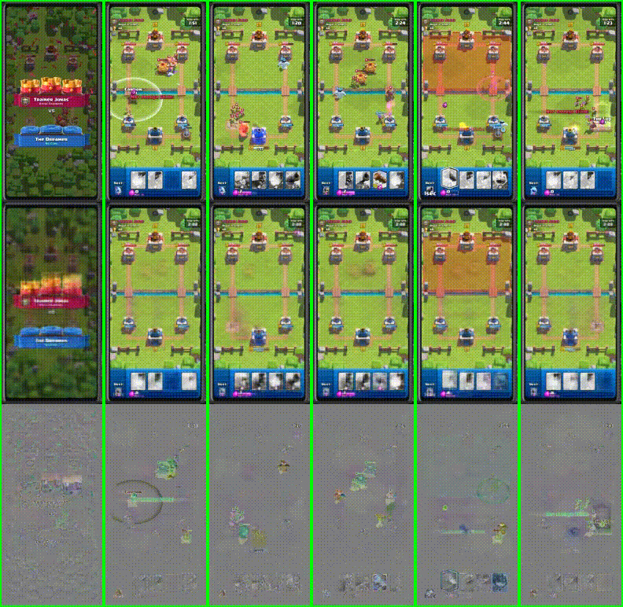

# Clash Royale Complete

This repository contains the Clash Royale environments and multiple DreamerV3
implementations, with a focus on the **PyTorch DreamerV3** in
`clash-royale-complete/dreamerv3-torch`.

## Project overview

We study model-based reinforcement learning for **Clash Royale**, a real-time strategy game with partial observability, long-horizon planning, and tight reaction constraints. The repository contains an end-to-end training stack built around **DreamerV3**, including a semantic UI state extractor, a pixel-based baseline, and automated training/evaluation against random and built-in opponents. In our experiments, agents learn basic strategy (≈60% win rate vs. random opponents with sparse rewards), while training against stronger opponents with dense rewards remains unstable and yields negative returns. We observe that noisy semantic extraction degrades planning, whereas pixel-based learning is more robust but substantially more expensive. Limited interaction speed (~1.5 FPS) and noisy credit assignment constrain performance, highlighting the need for better state representations, faster data collection, and improved reward design.

<p align="center">
  
</p>


## How Dreamer learns

The diagrams below summarize the two core learning loops: the actor improving its policy from imagined trajectories, and the world model updating its latent dynamics and reconstructions from real transitions before planning.

| Actor learning | World model learning |
| --- | --- |
|  |  |


## Quick start (PyTorch DreamerV3)

### 1) Create a Python env

```bash
python3 -m venv .venv
source .venv/bin/activate
```

### 2) Install dependencies

```bash
pip install -r clash-royale-complete/dreamerv3-torch/requirements.txt
```

> Default config uses `device: mps` (Apple Silicon). For CUDA, update
> `dreamerv3-torch/configs.yaml` or pass overrides in your run command.

### 3) Ensure Clash environment is available
DreamerV3 Clash uses ADB devices (real or emulator). Verify:

```bash
adb devices
```

At least one device must be listed and `device_ids` should be online.

### 4) Train (flagship)

```bash
cd clash-royale-complete/dreamerv3-torch
python dreamer.py --configs clash_royale_12m --logdir ./logdir/clash_v3_flagship --envs 2
```

### 5) Evaluate

```bash
cd clash-royale-complete/dreamerv3-torch
python dreamer.py --configs clash_royale_12m --logdir ./logdir/clash_v3_flagship \
  --envs 2 --eval_only True --eval_episode_num 20 --parallel False
```

## Logs and monitoring

- Training logs: `clash-royale-complete/dreamerv3-torch/logdir/`
- TensorBoard:

  ```bash
  tensorboard --logdir clash-royale-complete/dreamerv3-torch/logdir
  ```

## Where outputs live

Artifacts generated during analysis (tables, plots, videos) are stored under:

```
clash-royale-complete/dreamerv3-torch/logdir/summary_outputs/
```

## Common issues

- **No ADB devices**: make sure emulators are running and `adb devices` shows
  them as `device` (not `offline`).
- **No video logging**: `moviepy` is required for video summaries; if missing,
  the logger falls back to image strips.
